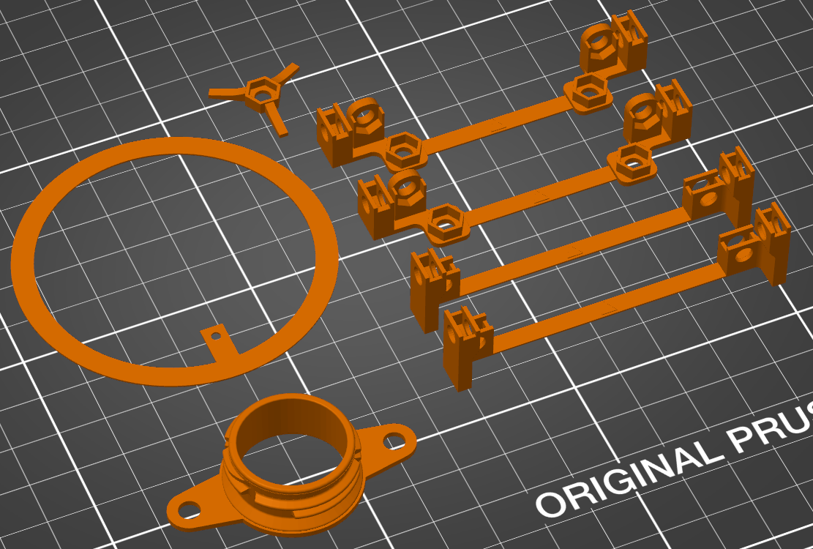

> Back to [documentation introduction](Introduction.md)

# 3D printing

You can download all the STL files for 3D printing [here](../3D_printing).

If you want do modify the 3D printed parts, you can download the [FreeCAD design file](../CAD), modify the parts in [FreeCAD](https://www.freecad.org/) and export the bodies via File -> Export, choosing "STL Mesh" as file format.

## Part list

This list shows you which parts to print and in what quantity:

| Quanitity | Part (STL file name) | Type |
|-----------|----------------------|------|
| 2         | Angle_bracket_bottom | Part |
| 2         | Angle_bracket_top    | Part |
| 1         | Adapter_for_pump     | Part |
| 1         | Wrench               | Tool |
| 1         | Drilling_template    | Tool |

- The angle brackets (bottom/top) and the adapter are parts of the product
- The wrench and drilling template are tools that are not part of the product, but will help you in the making and assembly process

## Filament material

Printing with PLA was tested and worked well. Other materials might work, too.

This filament was used for the prototype: https://www.3djake.de/formfutura/reform-rpla-turkish-blue

## Printing settings

Here are some recommended printing settings. 3D printing was tested with a Prusa MK3S with PLA. You can apply similar settings to other printers.

- **Print settings (Prusa slicer):** 0.15 mm QUALITY
- **Layer height:** 0.15 mm
- **First layer height:** 0.2 mm
- **Infill:** 15 %
- **Support material:** no supports needed

## Postprocessing

Make sure to remove all stringing from the 3D printed parts (e.g. by using some small scissors), especially inside the pockets for the nuts to make sure the nuts fit in well.
