> Back to [documentation introduction](Introduction.md)
# Assembly

## Part list

Make sure you have all the parts:
- 3D printed parts (list [here](Introduction.md), section 3D printing)
  - 5 parts for the dispenser (3D printed)
  - 1 wrench tool (3D printed, see image below)
  - 1 drilling template (3D printed)
- Laser cut parts ((list [here](Introduction.md), section laser cutting)
  - 6 parts (laser-cut)
- Purchased parts (list [here](Introduction.md), section shopping list)
  - Pump with pipe
  - Jar with lid
  - Screws and nuts (see images below)

<table>
  <tr>
    <td>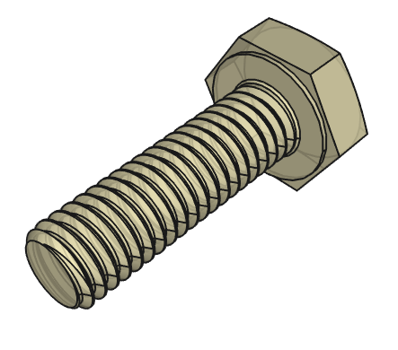</td>
    <td>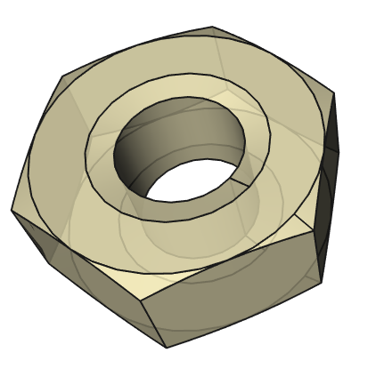</td>
    <td>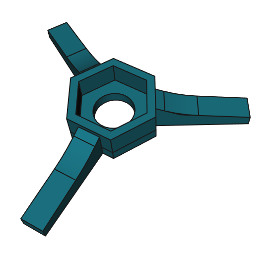</td>
  </tr>
  <tr>
    <td>M3 x 10 screw   Polypropylene (PP)   18 pieces</td></td>
    <td>M3 nut   Polypropylene (PP)   18 pieces</td>
    <td>Wrench (3D printed)</td>
  </tr>
</table>

<table>
  <tr>
    <td>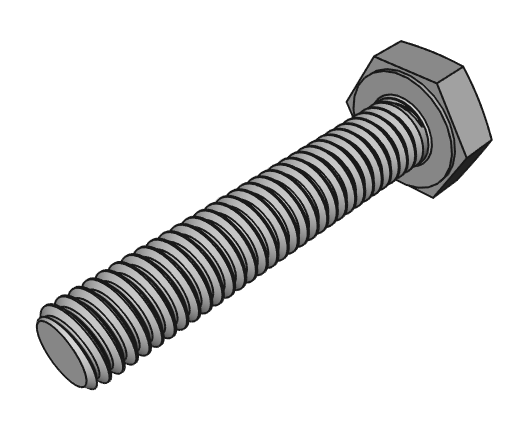</td>
    <td>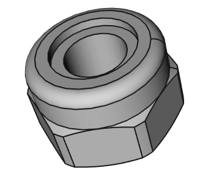</td>
    <td>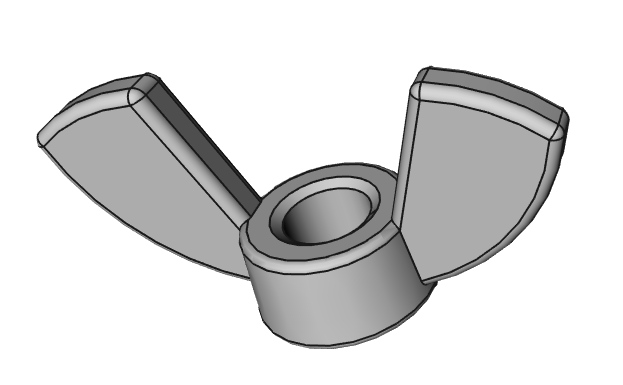</td>
  </tr>
  <tr>
    <td>M3 x 16 screw   Stainless steel   2 pieces</td>
    <td>M3 locknut   Stainless steel   2 pieces</td>
    <td>M3 wingnut   Stainless steel   2 pieces</td>
  </tr>
</table>

  ## Tool list
Check that you have all the tools you need.
- Small scissors (for removing stringing from the 3D printed parts)
- Large scissors or side cutter (for cutting the pump pipe)
- Tweezer (for putting the nuts in the 3D printed part pockets)
- Wrench for M3 nuts or small pliers (for tightening the M3 steel nuts)
- Drilling machine with 8 mm drill (drill size may vary depending on pump purchased)
- File (only needed if the parts are too thick and don't fit together)

## Arranging laser-cut parts

- Examine the six laser-cut parts from recycled plastics. For each part, decide which side you want on the outside of the dispenser (the visible side). Since all parts are symmetrical, they can be flipped to any side.
- Put the lid and bottom away for now and continue with the four side parts
- Decide which parts should be front, back, left and right
  - The **front** and **back** part are identical and can therefore be swapped
  - The **left** and **right** part are identical and can therefore be swapped
 
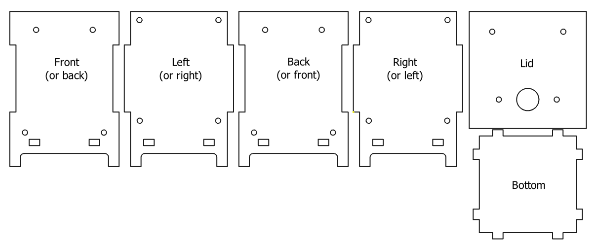

- Arrange the six side parts and the bottom part as seen in the picture below

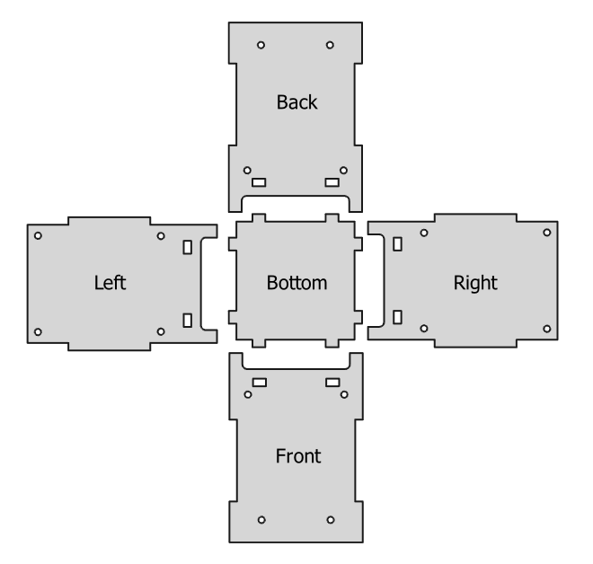

- Make a test assembly by putting the five parts together (without using screws or nuts for now). Check if the parts fit together
  - A tight fit is ideal, but if they are a little bit loose, it's still okay
  - If the parts are too thick and can't be pushed-in, you may try to process the parts a bit using a file or laser-cut one or several parts again from another sheet
- When done with the test assembly and everything fits fine, disassamble the parts and rearrange them as in the picture above, so you will remember which part is front/back/left/right
- Leave the laser-cut parts for now and continue with the 3D printed parts

## Putting nuts and screws in the 3D printed angle brackets

 <table>
  <tr>
    <td> 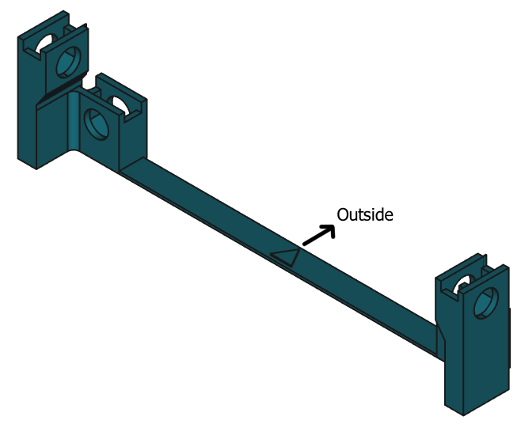 </td>
    <td>
      <ul>
        <li>Start with one of the 3D printed <b>bottom angle brackets</b> (there should be two of them)</li>
        <li>The small arrow shows where the outside will be and will help you in the assembly process later</li>
      </ul>
    </td>
  </tr>
</table>

 <table> <tr> <td> 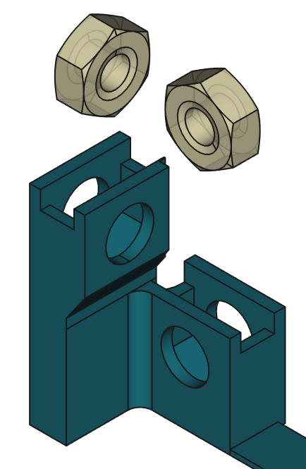   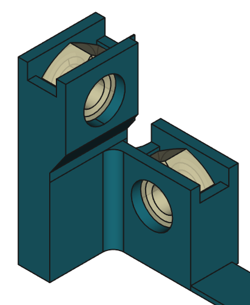 </td> <td> <ul>
        <li>Put the M3 nuts (PP) in the pockets</li>
        <li>You can use the tweezer to make it easier</li>
        <li>Make sure the holes of the nuts align with the holes in the pockets (take a look from the outside)</li>
        <li>Put all the nuts in the pockets (4 nuts for each bottom angle bracket)</li>
      </ul> </td> </tr> </table>

 <table> <tr> <td> 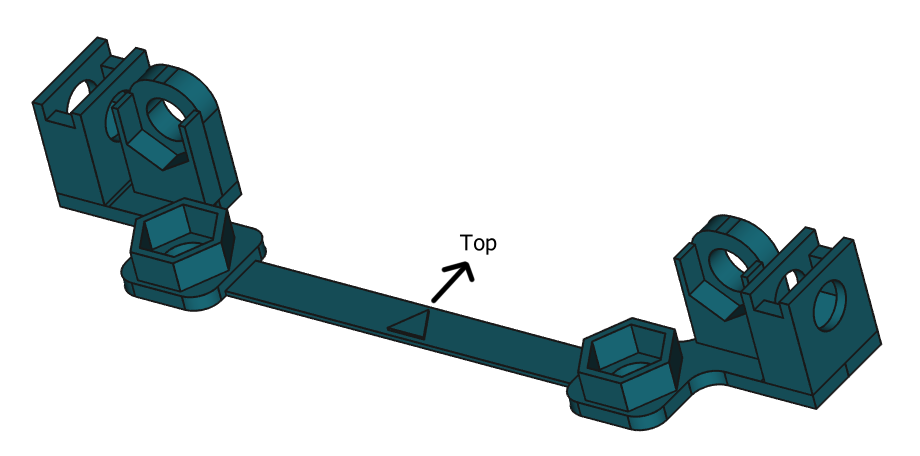 </td> <td> <ul>
        <li>Continue with one of the 3D printed <b>top angle brackets</b> (there should be two of them)</li>
        <li>The small arrow shows where the top will be and will help you in the assembly process later</li>
      </ul> </td> </tr> </table>

 <table> <tr> <td> 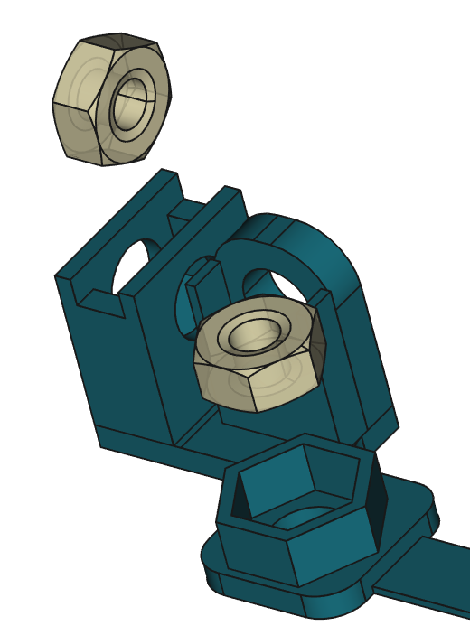   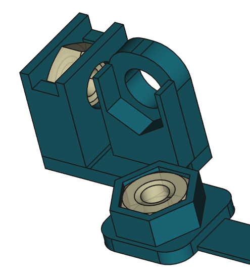 </td> <td> <ul>
        <li>Put the M3 nuts (PP) in the pockets</li>
        <li>Put all the nuts in the pockets (4 nuts for each top angle bracket)</li>
        <li>If you can't push the nut in the hexagonal pocket (the right one in the picture), take a PP screw, put on the nut on the tip of the screw (just turn it a little bit) and push the nut with the screw in the hexagonal pocket. After that, unscrew and take away the screw</li>
      </ul> </td> </tr> </table>

 <table> <tr> <td> 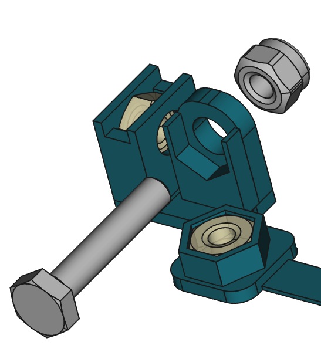   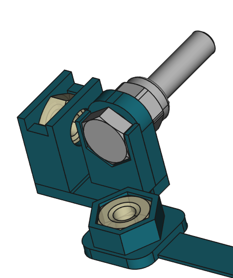 </td> <td> <ul>
        <li>One of the two top angle brackets should get two steel screws</li>
        <li>Put in the steel screw (M3 x 16) in the pocket and mount a M3 steel locknut on it</li>
        <li>Tighten it well (with a wrench or pliers) so the screw sits tight and won't move</li>
      </ul> </td> </tr> </table>

 <table> <tr> <td> 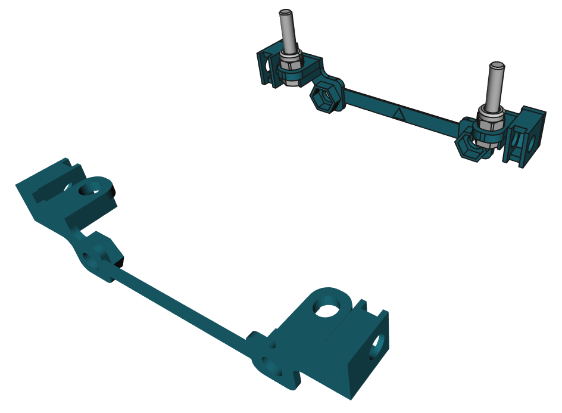 </td> <td> <ul>
        <li>After that, you should have one top bracket with two steel screws in it (and 4 PP nuts)</li>
        <li>This one will go to the <b>back side</b></li>
        <li>The other top bracket doesn't have steel screws (the holes stay empty), only 4 PP nuts</li>
        <li>This one will go to the <b>front side</b></li>
      </ul> </td> </tr> </table>

## Assembling the four side parts and the bottom part

 <table>
  <tr>
    <td> 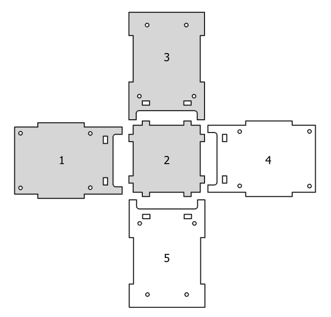 </td>
    <td>
      <ul>
        <li>The picture on the left shows the recommended order for assembly </li>
        <li>Once the first three parts (left (1), bottom (2) and back (3)) are assembled, the construction should stand and be stable</li>
      </ul>
    </td>
  </tr>
</table>

 <table> <tr> <td> 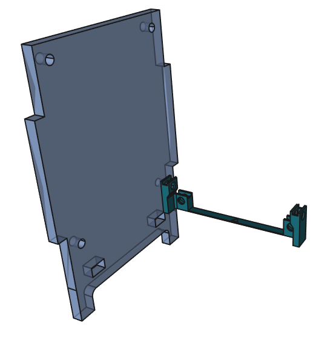 </td> <td> <ul>
        <li>Start with the left side part (1)</li>
        <li>Mount one <b>bottom bracket</b> (with the M3 PP nuts in it) to the side part</li>
      </ul> </td> </tr> </table>

- Put a M3 x 10 (PP) screw from the outside and tighten it with the 3D printed wrench

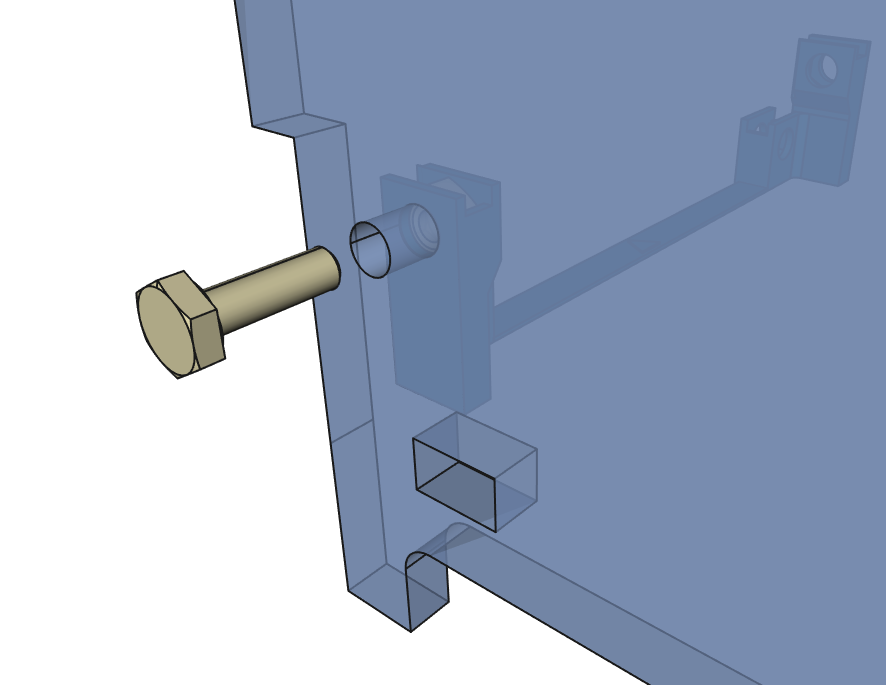 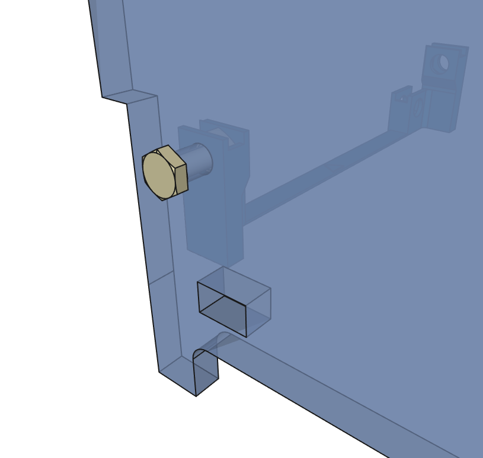 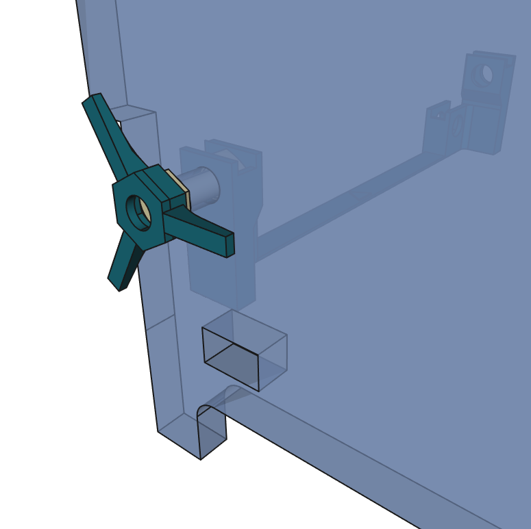

- Continue assembling the second **bottom bracket**, the bottom part (2) and the back part (3)
- Use M3 x 10 (PP) screws for connecting the parts and tighten them with the 3D printed wrench

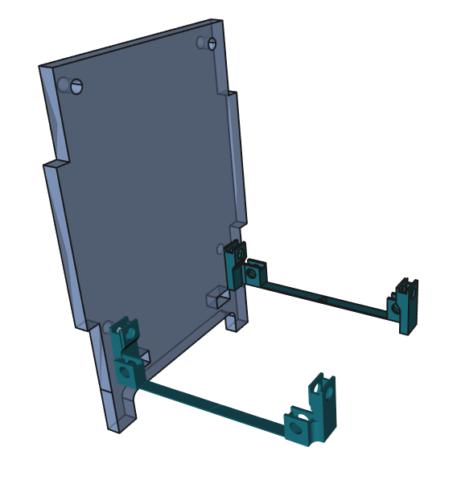 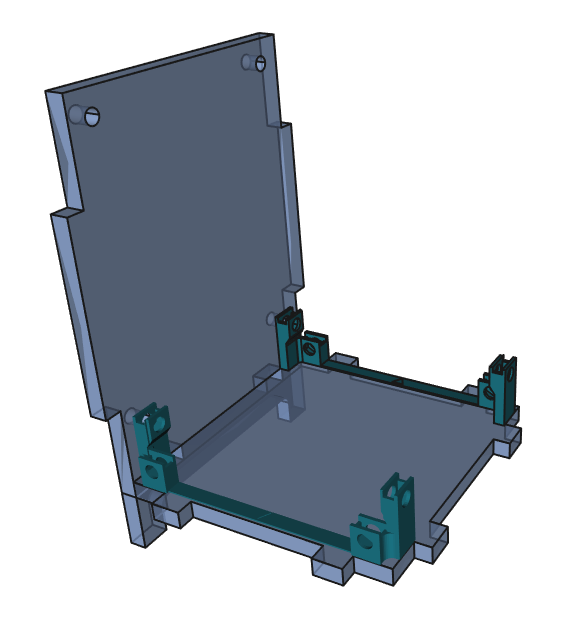 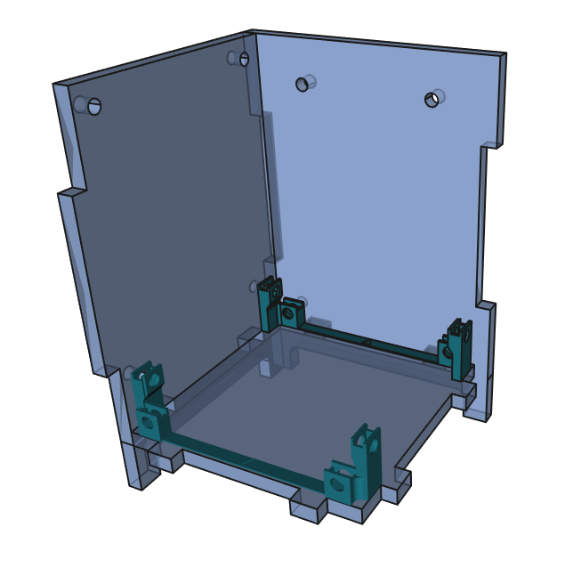

 <table> <tr> <td> 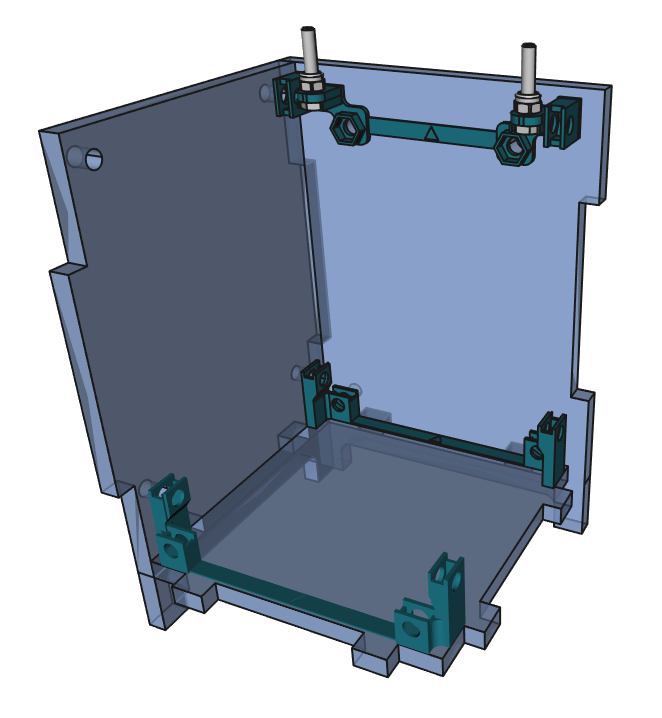 </td> <td> <ul>
        <li>Mount the <b>top bracket</b> (the one with the two steel screws) to the back side</li>
        <li>Use PP screws for connecting the parts</li>
      </ul> </td> </tr> </table>

 <table> <tr> <td> 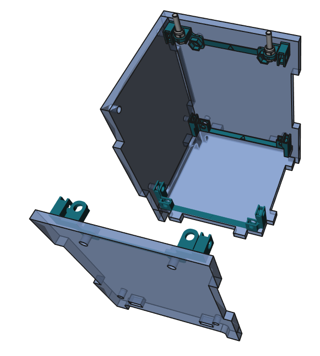 </td> <td> <ul>
        <li>Mount the other <b>top bracket</b> (the one without steel screws) to the front side using PP screws</li>
        <li>Don't mount the front part yet. Put it aside for now.</li>
      </ul> </td> </tr> </table>

 <table> <tr> <td> 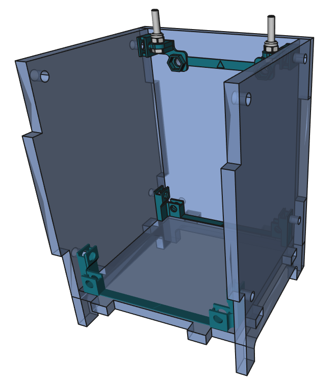 </td> <td> <ul>
        <li>Mount the right part to the construcion using PP screws</li>
      </ul> </td> </tr> </table>

## Assembling the lid and the pump

- Put the 3D printed threaded adapter on top of the lid
- Make sure you put it on the correct side (if you prefer the other side to be visible, flip the lid)

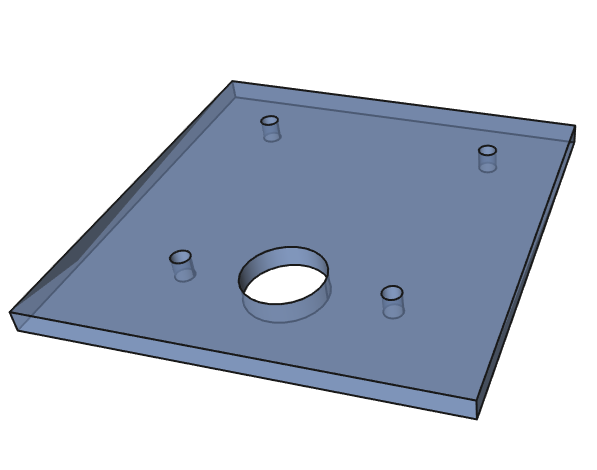 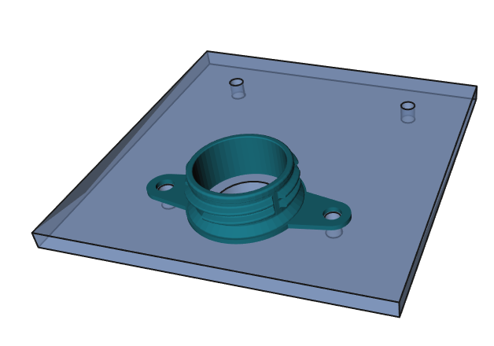

- Use two M3 x 10 screws (PP) and two M3 nuts (PP) to mount it
- The nuts should be on the bottom

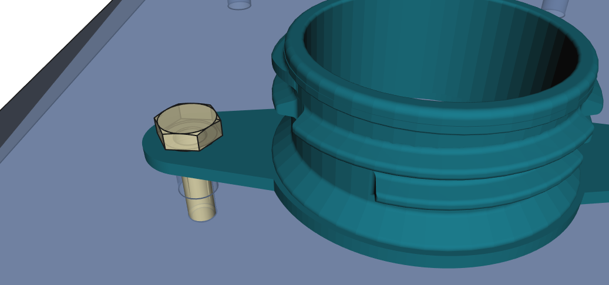 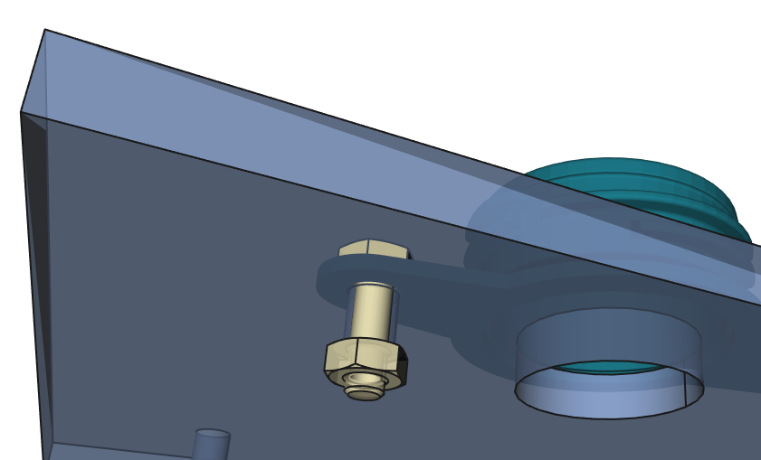

