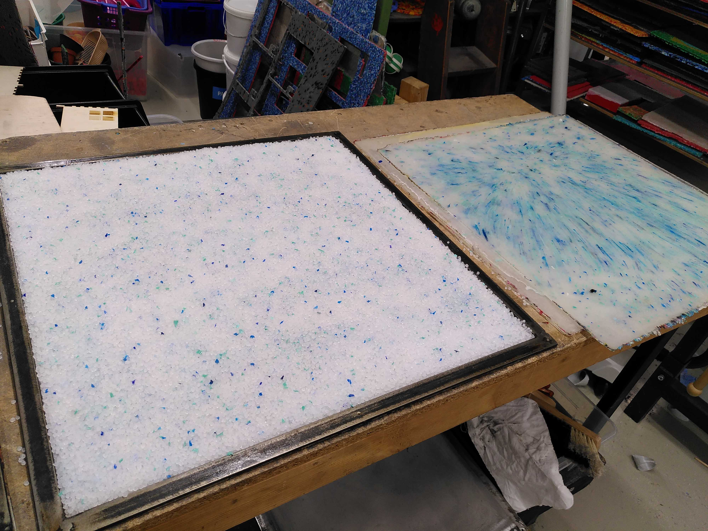
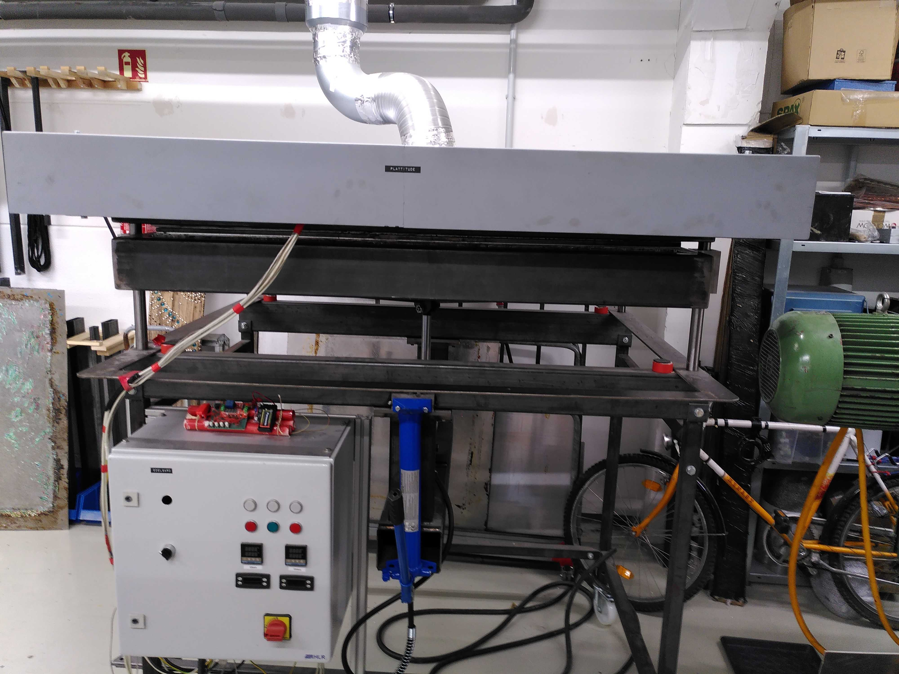
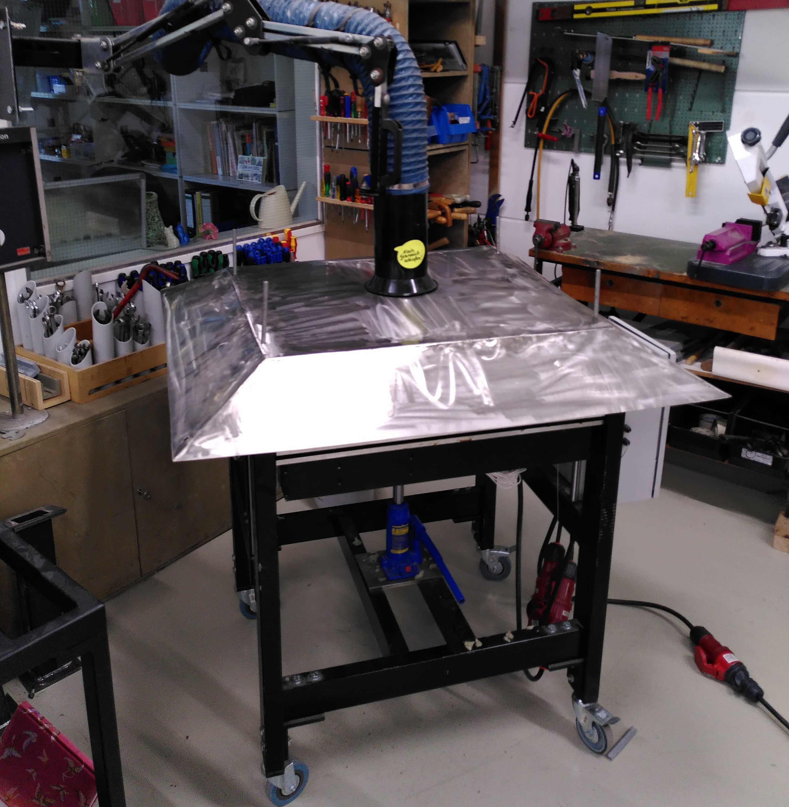
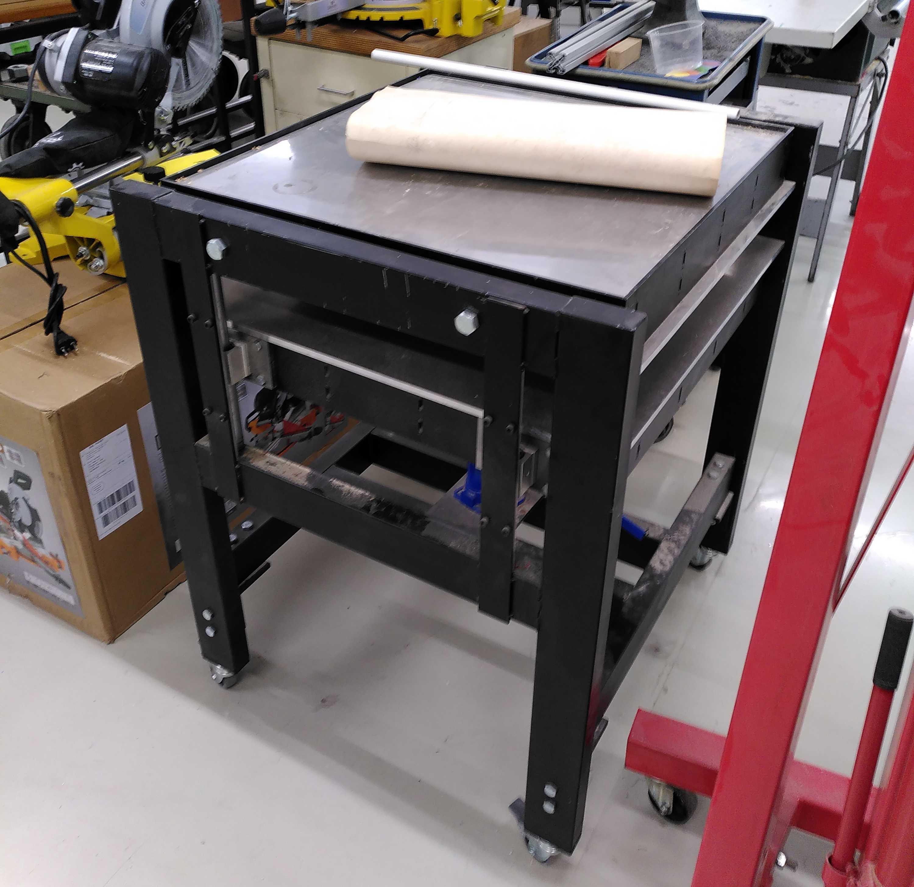
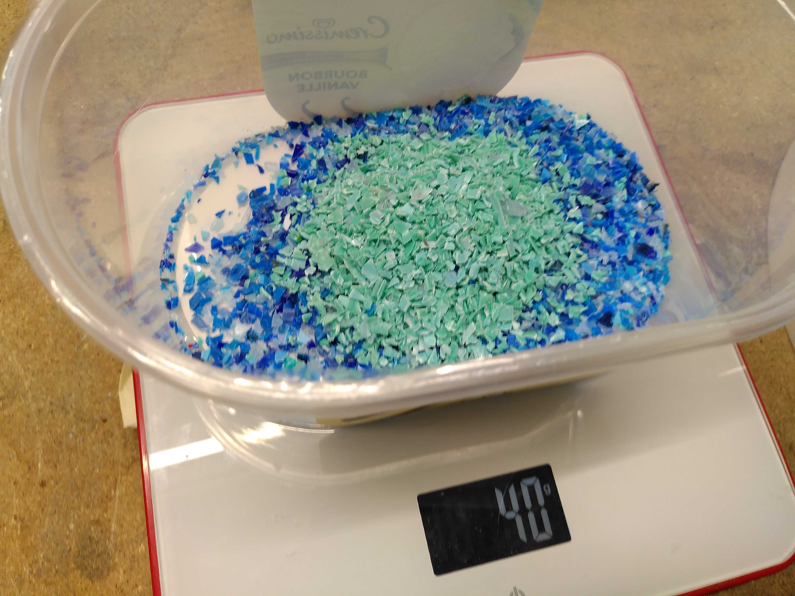
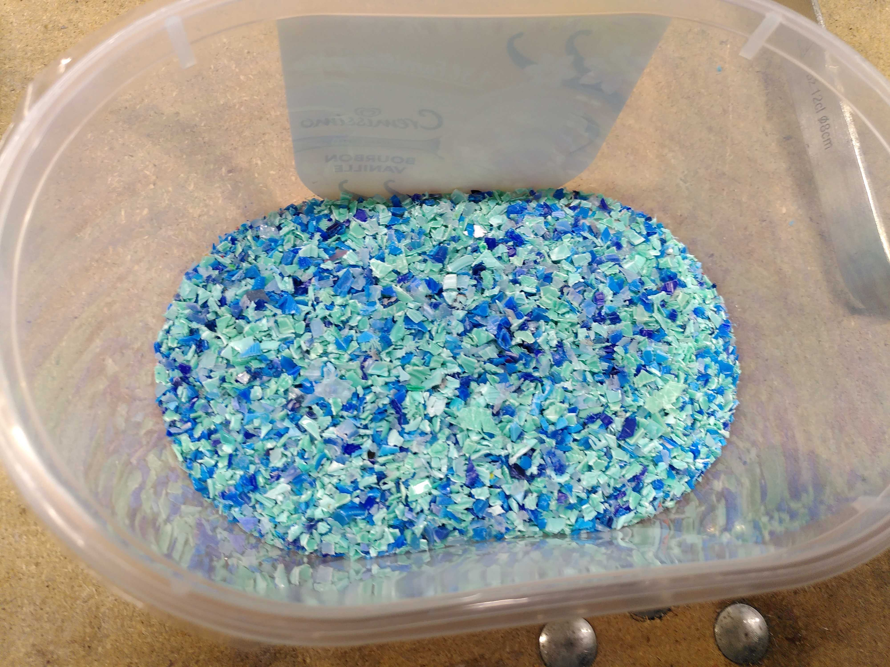
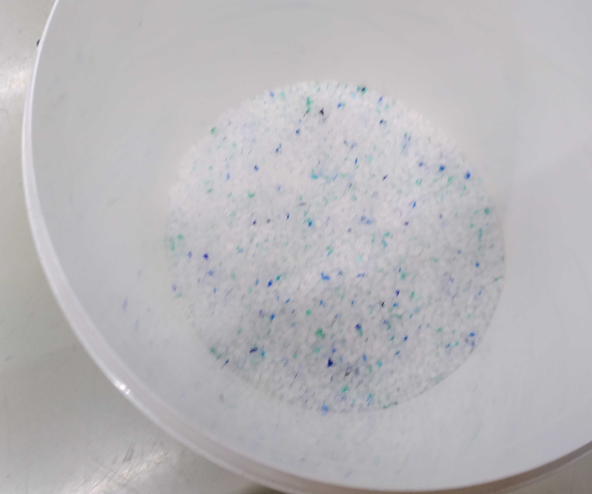
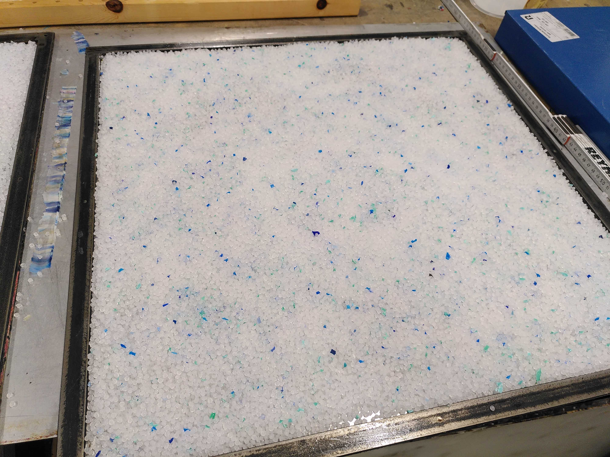
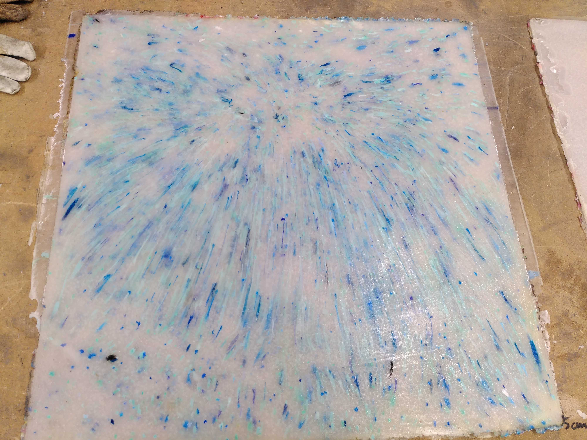
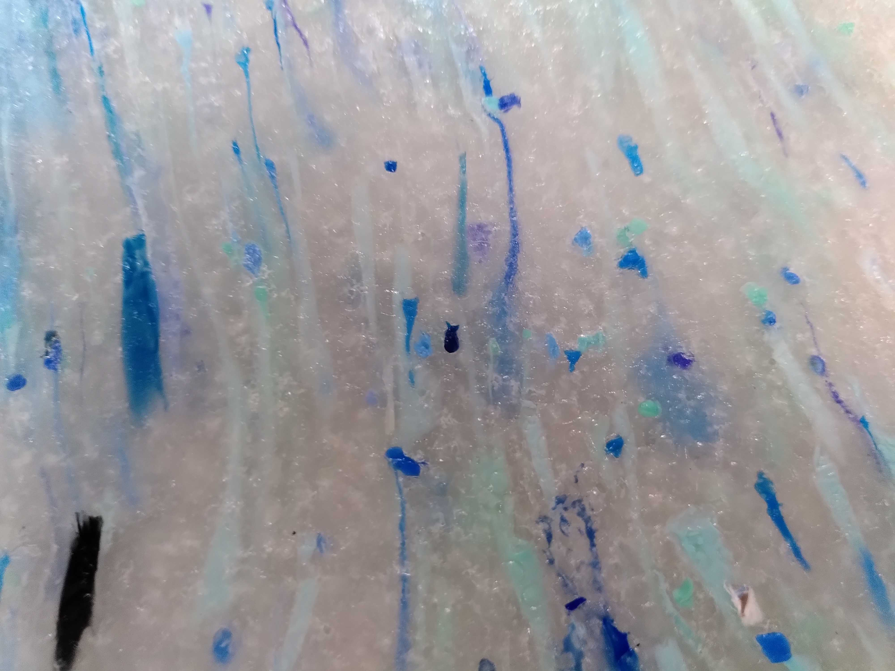

> Back to [documentation introduction](Introduction.md)

# Making sheets from recycled plastics

Here are some instructions for making sheets from recycled plastic using [Precious Plastic](https://preciousplastic.com/) methods.

## Tools and machines needed

- Plastic shredder (like the [Precious Plastic shredder](https://community.preciousplastic.com/academy/build/shredderpro) or similar)
- Plastic sheet press (like the [Precious Plastic sheet press](https://community.preciousplastic.com/academy/build/sheetpress) or similar)
  - Optional: Cooling press

  

_Images above: Large sheet press (1 x 1 m) - Small sheet press (60 x 60 cm) - Cooling press (60 x 60 cm)_

## Material

There are many types of plastics that can be recycled using Precious Plastic methods. However, it is recommended to use **PP (polypropylene)**, because PP is particularly suitable for laser cutting.

## Shredding

Make sure to use only PP (polypropylene) plastics and don't mix it with any other types of plastics.

## Using purchased plastics

If you don't have enough PP plastic for recycling, you can still purchase PP (polypropylene) from online shops. It's hard to find shops for colored PP pellets, but colorless (white/translucent) PP pellets are quite common and can be purchased from many online shops.

## Pressing sheets

The sheets should have a thickness of about 4.7 mm. This way you can use the standard SVG file (vector graphics) for laser cutting provided in this repository. But you can still generate SVG vector graphics for other thicknesses (read more in the [documentation](Introduction.md), section Modding and upgrades).

Sheets with a thickness of 4 to 5 mm should work well, too. When using sheets with more than 5 mm you might get trouble with laser cutting them.

### Example calculation for sheet mould and plastic weight

> :warning: This is an example calculation for a specific mould. If your mould has different dimensions, adjust the calculation accordingly.

A mould measuring 560 x 560 x 4 mm was used for the prototype. So the mold had a thickness of 4 mm.
However, due to some inaccuracies, sheets came out more like 4.5 to 5 mm thick.

First you should calculate the weight of the plastic you need. In this example:
- Volume = 56 x 56 x 0.4 cm =  1254.4 cm³
- Density of PP = 0.93 g/cm³
- Weight = Volume x Density = 1254.4 cm³ x 0.93 g/cm³ = 1166.59 g
- Adding 5 % : 1166.592 g x 1.05 = 1224.92 g
  - Experience shows that the calculated amount is often not quite enough and you should add about 5 %

This example therefore results in a weight of about **1225 g**.

If you mix different colors, the sum should be 1225 g. For example, the white sheets with blue and turquoise sprinkles (as seen in the images) was mixed from:
- 1185 g white
- +20 g blue
- +20 g turquoise
  - adds up to 1225 g
 
Depending on your machine and process, these values may also vary. Several attempts should be made to determine the correct weight.

  

### Making the sheet

- If you used different colors, mix them well in a bucket
- Apply some silicon grease on the bottom of the mould
- Pour in the plastic granulate in the mould and level it

- Put a metal sheet on top of it
- Place the mould with the plastic in your sheet press
- Raise the lower plate by using the jack (depends on your machine) until the top metal sheet barely touches the top side of the sheet press
- Preheat it to 230 °C (recommended temperature for PP by Precious Plastic)
- Wait 10 mins
  - Apply some more pressure using the jack
  - Repeat this process three more times
> ℹ️ This procedere makes sure that you wont't have any air bubbles inside your sheet
- After adding pressure four times and therefore 40 mins of baking you can turn off the heating
- For cooling down there are two options:
  - Let the sheet cool down for about 3 hours in the sheet press (if you don't have a cooling press)
  - If you have a cooling press, you can move the sheet to the cooling press, apply pressure and let it cool down for 3 hours
- Remove the mould from the press and take out the sheet

 

## Postprocessing

- If your sheet feels greasy from the silicone, use some dish soap or vinegar to remove the grease and wash it off with water
- Cut off the edges with a table saw or utility knife
- Measure the thickness at different points on the edge. If it is around 4.0 to 5.5 mm thick, it should be okay, but if it varies more than 0.5 mm, it could cause difficulties in the laser cutting process.
- Examine your sheet on both sides and check if it has any air bubbles. Small air bubbles should be okay, but larger air pockets or cavities should be avoided in the laser cutting.
