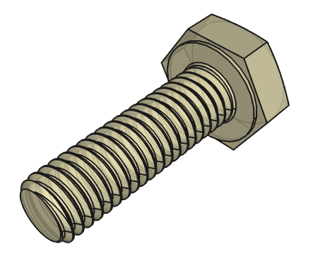
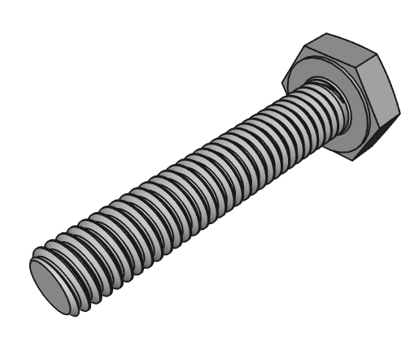

> Back to [documentation introduction](Introduction.md)

# Shopping list

## Standard parts

Here is a list of standard parts:

| Quantitiy | Part           | Material              | Standard                      | Shop link (suggestion)                                                                                          |
|-----------|----------------|-----------------------|-------------------------------|-----------------------------------------------------------------------------------------------------------------|
| 16         | M3 x 10 screw | PP (Polypropylene)    | DIN 933/931 / DIN EN ISO 4017 | [Link](https://www.kunststoffschraube.de/product_info.php?products_id=4129)                                     |
| 16         | M3 nut        | PP (Polypropylene)    | DIN 555/934 / DIN EN ISO 4032 | [Link](https://www.kunststoffschraube.de/product_info.php?products_id=4185)                                     |
| 2          | M3 x 16 screw | Stainless steel       | DIN 933 / DIN EN ISO 4017     | [Link](https://www.schraubenking-shop.de/M3-x-16mm-Sechskantschrauben-DIN-933-Vollgewinde-Edelstahl-A2-P000418) |
| 2          | M3 nut        | Stainless steel       | DIN 934 / DIN EN ISO 4032     | [Link](https://www.schraubenking-shop.de/M3-Sechskantmuttern-DIN-934-Edelstahl-A2-P000447)                      |
| 2          | M3 wingnut    | Stainless steel       | DIN 315 or similar            | [Link](https://www.schraubenking-shop.de/M3-Fluegelmutter-amerik-Form-Edelstahl-A2-P004284)                     |

<table>
  <tr>
    <td></td>
    <td></td>    
  </tr>
  <tr>
    <td>M3 x 10 screw   Polypropylene (PP)   18 pieces</td></td>
    <td>M3 nut   Polypropylene (PP)   18 pieces</td>
  </tr>
</table>

<table>
  <tr>
    <td></td>
    <td></td>
    <td></td>
  </tr>
  <tr>
    <td>M3 x 16 screw   Stainless steel   2 pieces</td>
    <td>M3 nut   Stainless steel   2 pieces</td>
    <td>M3 wingnut   Stainless steel   2 pieces</td>
  </tr>
</table>

- Most of the screws and nuts are suggested to be made from Polypropylene (PP). The reasons are:
  - PP is lighter than steel, which makes the whole dispenser lighter
  - PP is recyclebale in plastic recycling machines and PP is the same material that the sheets are made from. This way, broken or used PP screws and nuts can be recycled and new sheets can be made from the PP material.
  - PP parts have a nice translucent look, they are not so visible and don't stand out too much
  - But you can still use steel screws and nuts instead of PP if you like

- The two M3 x 16 screws, nuts and wingnuts in the lid should be stainless steel. The reasons are:
  - These wingnuts have to be undone everytime you want to refill your dispenser. Plastic screws and nuts tend to wear off and break quickly, so steel parts are recommended
  - Stainless steel is recommended as these parts may get in contact with water a lot (by splashes from the water tap or wet hands)
 
- All screws should be hex head screws so that they fit into the pockets of the 3D printed parts

## Other parts

Here is a list of other parts:

| Quantitiy | Part                | Shop link (suggestion)                                                                           |
|-----------|---------------------|--------------------------------------------------------------------------------------------------|
| 1         | Soap dispenser pump | [Link](https://www.amazon.de/Ertisa-Edelstahl-seifenspender-flüssiges-Badezimmer/dp/B086PS4G4Q/) |

- If the suggested pump is not available, get a similar one or reuse a pump from another dispenser. Just make sure that it fits on the thread.

