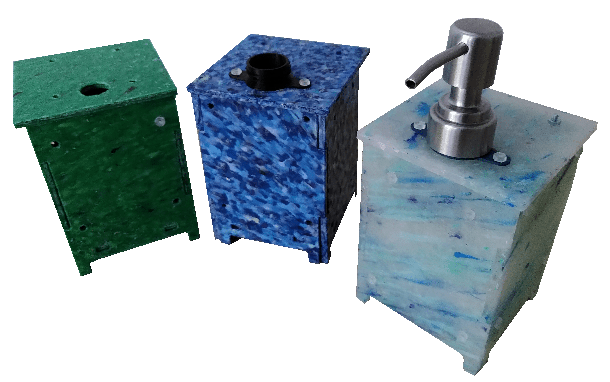
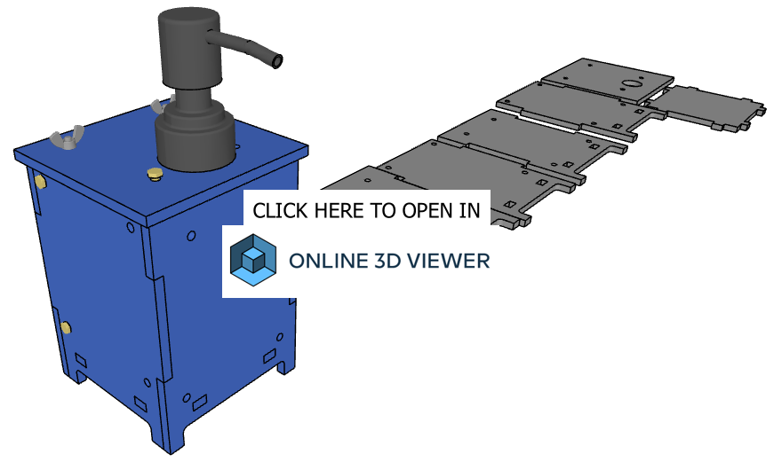

# orcuDispenser

## Liquid dispenser from recycled plastics

 

The orcuDispenser (short for "Orcular Dispenser") is an open-source dispenser made from recycled plastics. The main features are:
- For soap or other liquids like dishwashing liquid, shampoo or body wash
- Made from recycled plastics ("Precious Plastic" sheets)
- Laser-cut parts
- 3D printed parts
- Circular design
  - Easy to repair & upgrade
  - Designed for disassembly
  - All parts recyclebale (except for the pump, depends on the product)
- Open-source hardware
- Designed in FreeCAD (open-source software)
  - CAD file accessible in this repository
  - Parametric design (other sizes are easy to generate)

## 3D view

- Please be patient and wait about a minute to load the online 3D view

Controls:
- On computer: Use the left mouse button to rotate, the right mouse button to pan and the mouse wheel to zoom
- On smartphones: Swipe to rotate, use two fingers to zoom and pan 

- Alternative 3D view with more tools [here](https://3dviewer.net/#model=https://raw.githubusercontent.com/orcular-org/orcuDispenser/main/CAD/Online3Dviewer/orcuDispenser_Online3Dviewer_STEP.step)
  - Click "Set Z axis as up vector" for better display  
  - You can hide/show parts and groups on the left-hand side
  - For a complete view of the 3D file, download the [CAD file](CAD) and open it in [FreeCAD](https://www.freecad.org/)
 
## Building instructions
 
For making and building instructions, see the [documentation](Documentation/Introduction.md).

## About the Orcular project
The orcuDispenser is part of the Orcular project - https://www.orcular.org

"Orcular" stands for **O**pen Source + Ci**rcular** Economy

The project is about design concepts for locally recyclable products - for a constantly growing open source product library and the development of inner-city production.

Most components can be recycled into new parts - all within one city.
Recyclable plastic parts from the laser cutter, 3D printer and CNC mill, supplemented by standard parts.

## License

The orcuDispenser hardware design, CAD files, BOM, and relative files are are released under the following open source license:

- [CERN Open Hardware Licence Version 2 Weakly Reciprocal - CERN-OHL-W](https://cern-ohl.web.cern.ch/)

The orcuDispenser documentation, assembly manual, pictures and presentation text of this repository are released under the following license:

- [Creative-Commons-Attribution-ShareAlike 4.0 International - CC BY-SA 4.0](http://creativecommons.org/licenses/by-sa/4.0/)

**Author:** Oskar Lidtke, https://github.com/orcular-org/

 Except where otherwise noted, this work is licensed under a <a rel="license" href="http://creativecommons.org/licenses/by-sa/4.0/">Creative Commons Attribution-ShareAlike 4.0 International License (CC BY-SA 4.0)</a>.

See best practices for [attribution](https://wiki.creativecommons.org/wiki/Best_practices_for_attribution) and [marking your own work](https://wiki.creativecommons.org/wiki/Marking_your_work_with_a_CC_license) with a CC license.

<i>  Open Source Hardware logo, <a href="https://creativecommons.org/licenses/by-sa/4.0/">CC BY-SA</a> - <a href="https://www.oshwa.org/open-source-hardware-logo/">Source</a> </i>

